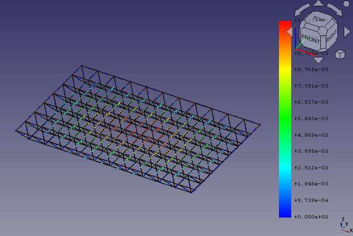
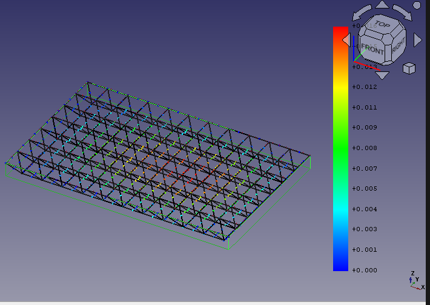

# 7.23 Qiqihaer Sports Arena Collapse Analysis Report
# 7.23 齐齐哈尔体育馆坍塌事件调查

## 1. Introduction
* **Background**: Qiqihar is a prefecture-level city with a population of about 5 million in China, the second-largest in the northernmost and easternmost province of China, Heilongjiang. Qiqihaer's 34th middle school’s gym that collapsed in this incident is reported to be built in 1997 with an area of 1,200 square metres. The accident killed 11 young women.
* **背景**: 齐齐哈尔是一个拥有500万人口的地级市, 是东北省份黑龙江的第二大城市。 在本次时间中坍塌的齐齐哈尔三十四中体育馆建造于1997年，面积为1200平方米. 11位年轻女性在事件中丧生。
* **Objective**: This report aims to find out the main cause of the accident.
* **目的**: 本报告试图寻找事故发生原因
  

## 2. Accident details
The reason of collapse is commonly believed to be the wrongly placed building materials made of perlite on the roof. 
There was a construction project nearby and workers stacked perlite on the top of the gym for the sake of convenience. On Jul 23 a 30mm precipitation was reported and the perlite aborbed a large amount of rain water. The weight of perlite could be increased 2 - 16 times which could be the cause of the structural failure.
Noticeably the roof made of steel space frame collapsed as a whole, no steel member left with the support.
一般认为，事故原因是由于屋顶违规堆放的珍珠岩。
体育馆附近有一处工地，工地工人为便利将珍珠岩堆放在体育馆的屋顶。在七月23日有30毫米的降水，珍珠岩吸收了大量雨水。珍珠岩的重量吸水后可以增加2-16倍，导致建筑物的垮塌。
值得注意的是屋顶整体垮塌，在钢结构支撑处没有构件与之连接。

## 3. Methodology
FEM with FreeCAD is applied on the structure. The source code: /src/test.py can be run under freeCAD's Python console and build the model.
利用基于FreeCAD 的有限元分析。源码：/src/test.py 可以在freeCAD 的Python终端上运行

Based on [1], the weight of the rooftop cement board is 2.4KN/m^2, and the self-weight of the truss is 0.26KN/m^2.
基于[1], 屋顶水泥板重量为2.4KN/m^2, 网架自重0.26KN/m^2。

Based on the rescue site video [2], it's estimated that each bag of perlite weighs about 20KG. The bag size is approximately 0.6X0.4X0.2 m^3. With a stacking height of 1.2 meters, the weight per square meter is: 20X1.2/(0.6X0.4X0.2) = 500kg, which is approximately 5000N/m^2.
基于救援现场视频[2]， 估算珍珠岩每袋约20KG, 袋子尺寸约为 0.6X0.4X0.2 m^3, 堆放高度为1.2米，每平方米的重量为: 20X1.2/(0.6X0.4X0.2) = 500kg 约等于 5000N/m^2。

按照规范规定，屋顶活动载荷为50kg/m^2, 雪载按照五十年一遇计算，约为50kg/m^2, 安全储备取1.35
活动荷载与雪载为：
50kg + 50kg = 100kg/m^2 约为1000N/m^2

It's estimated that the spacing of the trusses is 3 meters. The length of the truss is 12X3=36 meters, and the width is 8X3=24 meters.
估算网架间隔为3米，网架长为12X3=36米， 宽8X3=24米。

Based on the above data, modeling is done in FreeCAD.
基于以上数据进行freeCAD建模。

## 4. Findings
未堆放珍珠岩情况下:
连接处最大垂直压力为7.756077E+04N， 位于节点 (x=5, y=7)
连接处最大水平压力为1.032378E+05N， 位于节点 (x=6, y=0)
各节点位移情况:

事故发生时:
连接处最大垂直压力为1.201489E+05N, 位于节点 (x=8, y=0) (x=8,y=7)
连接处最大水平拉力为1.428545E+05N, 位于节点 (x=8, y=0) (x=8,y=7) 
各节点位移情况:

施加最大允许荷载的情况下:
连接处最大垂直压力为1.169283E+05N, 位于(x=6, y=0) (x=6,y=7)
连接处最大水平拉力为1.554994E+05N, 位于(x=5, y=0) (x=5,y=7)

