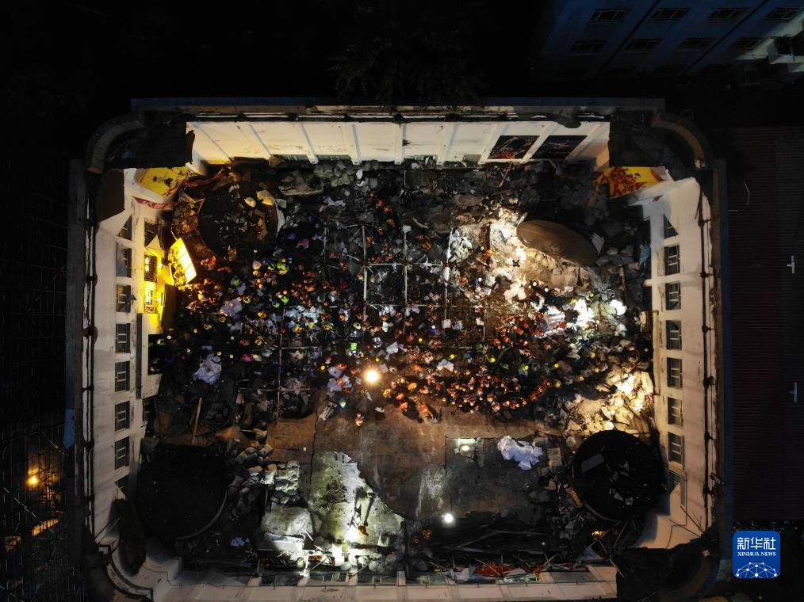
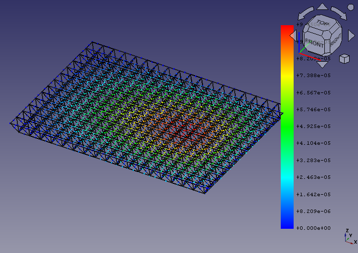
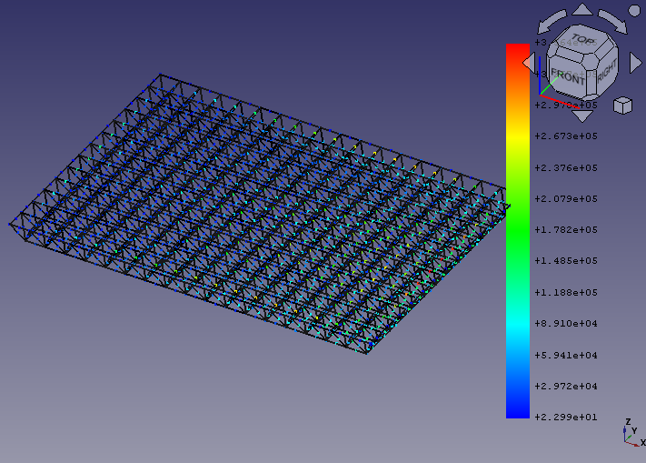

# 7.23 Qiqihaer Sports Arena Collapse Analysis Report
## 1. Introduction
* **Background**: Qiqihar is a prefecture-level city with a population of about 5 million in China, the second-largest in the northernmost and easternmost province of China, Heilongjiang. Qiqihaer's 34th middle school’s gym that collapsed in this incident is reported to be built in 1997 with an area of 1,200 square metres. The accident killed 11 young women.
* **Objective**: This report aims to find out the main cause of the accident.

## 2. Accident details
The reason of collapse is commonly believed to be the wrongly placed building materials made of perlite on the roof. 
There was a construction project nearby and workers stacked perlite on the top of the gym for the sake of convenience. On Jul 23 a 30mm precipitation was reported and the perlite aborbed a large amount of rain water. The weight of perlite could be increased 2 - 16 times which could be the cause of the structural failure.
Noticeably the roof made of steel space frame collapsed as a whole, no steel member left with the support.

## 3. Methodology
FEM with FreeCAD is applied on the structure. The source code: /src/test.py can be run under freeCAD's Python console and build the model.

## 4. Findings
Displacement Distribution

Stress Distribution

